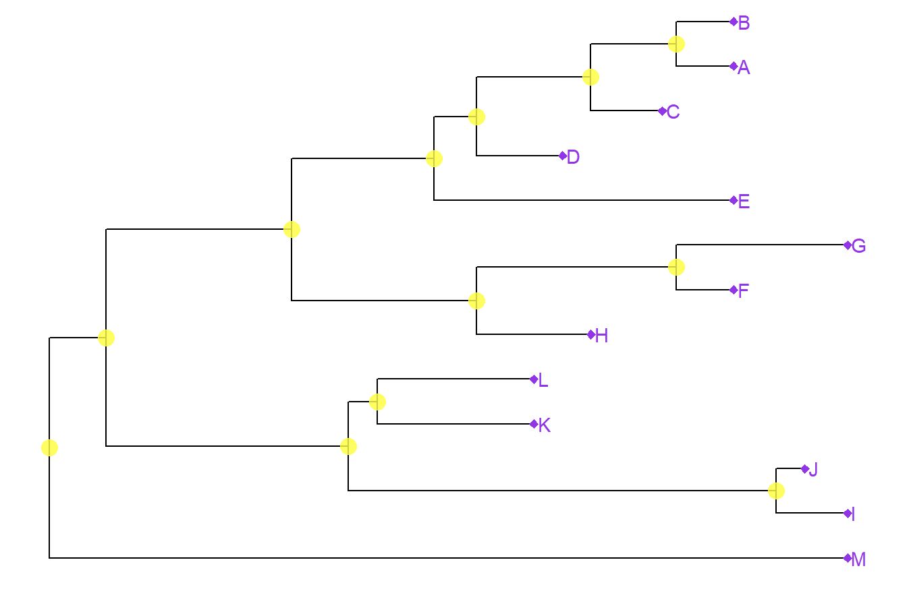

```{r setup, include=FALSE}
knitr::opts_chunk$set(echo = TRUE)
```

```{r}
library(tidyverse)
library(ggtree)
library(knitr)
library(ggplot2)
```
```{r}
if (!requireNamespace("BiocManager", quietly = TRUE))
    install.packages("BiocManager")

BiocManager::install("ggtree")
```
```{r}
# added treeio and ggimage library
library(treeio)
```
```{r}
if (!requireNamespace("BiocManager", quietly = TRUE))
    install.packages("BiocManager")

BiocManager::install("ggimage")
```
```{r}
library(ggimage)
# need to install libmagick 
#sudo apt-get install libmagick++-dev
```
```{r}
tree <- read.tree("data/tree_newick.nwk")
tree
```
```{r}
# build a ggplot with a geom_tree
ggplot(tree) + geom_tree() + theme_tree()
```
```{r}
# This is convenient shorthand
ggtree(tree)
```
```{r}
# add a scale
ggtree(tree) + geom_treescale()
```
```{r}
# or add the entire scale to the x axis with theme_tree2()
ggtree(tree) + theme_tree2()
```
```{r}
# default is to plot a phylograpm, where x-axis shows genetic change/evolutionary distance
# if you want to disable scaling & produce cladogram instead

ggtree(tree,branch.length="none")
```
```{r}
ggtree(tree, branch.length="none", color="blue", size=2, linetype=3)
```

## Exercise 1
```{r}
# create a slanted phylognetic tree 
ggtree(tree, layout = "slanted")
```
```{r}
# Create a circular phylogenetic tree
ggtree(tree, layout="circular")
```
```{r}
# Create a circular unscaled cladogram with thick red lines.
ggtree(tree, branch.length="none", color="red", size=2, linetype=3)
```

## Other Tree Geoms
```{r}
# create the basic plot
p <- ggtree(tree)
# add node points
p + geom_nodepoint()
```
```{r}
# add tip points
p + geom_tippoint()
```
```{r}
# label the tips
p + geom_tiplab()
```

## Exercise 2
```{r}

```

## Internal Node Number
```{r}
ggtree(tree) + geom_text(aes(label=node), hjust=-.3)
```
```{r}
ggtree(tree) + geom_tiplab()
```
```{r}
MRCA(tree, c("C", "E"))
```
```{r}
MRCA(tree, c("G", "H"))
```

## Labelling Clades
```{r}
ggtree(tree) + 
  geom_cladelabel(node=17, label="Some random clade", color="red")
```
```{r}
ggtree(tree) + 
  geom_tiplab() + 
  geom_cladelabel(node=17, label="Some random clade", 
                  color="red2", offset=.8)
```
```{r}
ggtree(tree) + 
  geom_tiplab() + 
  geom_cladelabel(node=17, label="Some random clade", 
                  color="red2", offset=.8) + 
  geom_cladelabel(node=21, label="A different clade", 
                  color="blue", offset=.8)
```
```{r}
ggtree(tree) + 
  geom_tiplab() + 
  geom_cladelabel(node=17, label="Some random clade", 
                  color="red2", offset=.8, align=TRUE) + 
  geom_cladelabel(node=21, label="A different clade", 
                  color="blue", offset=.8, align=TRUE) + 
  theme_tree2() + 
  xlim(0, 70) + 
  theme_tree()
```
```{r}
ggtree(tree) + 
  geom_tiplab() + 
  geom_hilight(node=17, fill="gold") + 
  geom_hilight(node=21, fill="purple")
```

## Connecting Taxa
```{r}
ggtree(tree) + 
  geom_tiplab() + 
  geom_taxalink("E", "H", color="blue3") +
  geom_taxalink("C", "G", color="orange2", curvature=-.9)
```

## Exercise 3
```{r}
# determine nodes w/ MRCA() function
MRCA(tree, c("B", "C")) #node 19
```
```{r}
# determine nodes w/ MRCA() function
MRCA(tree, c("B", "C")) #node 19
```
```{r}
# draw the tree
ggtree(tree) +
geom_tiplab() + 
  geom_hilight(node=19, fill="red") + 
  geom_hilight(node=23, fill="purple") +
  geom_cladelabel(node=17, label="Superclade 17", color="red2", offset=-7, align=TRUE) +
  geom_taxalink("C", "E", color="grey", linetype=2) +
  geom_taxalink("G", "J", color="grey",linetype=2) +
  theme_tree2() + 
  xlim(0, 60)+ 
  ggtitle("Exercise 3 Figure")
```